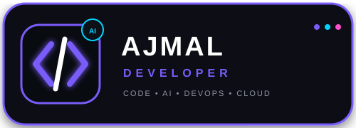

👋𝗛ᴇʏ, 𝗜ᴍ 𝗠ᴏʜᴀᴍᴍᴇᴅ 𝗔ᴊᴀᴍʟ

🚀 𝗗ᴇᴠᴇʟᴏᴩᴇʀ • 🤖𝗔𝗜|𝗠𝗟 𝗟ᴇʀɴɪɴɢ • 🐍 𝗣ʏᴛʜᴏɴ 𝗗ᴇᴠᴇʟᴏᴩᴇʀ • ☁️ 𝗗ᴇᴠᴏᴩꜱ 𝗘ɴᴛʜᴜꜱɪᴀꜱᴛ

   

  

  

---

<h1>🧑‍💻 𝗔𝗕𝗢𝗨𝗧 𝗠𝗘</h1>

💡 "I don't just want to use technology — I want to understand how it works, build with it, and continuously improve."»

Hi! I'm Mohammad Ajmal, a passionate Developer, AI Builder, Python Developer, and DevOps enthusiast.

I'm interested in understanding how modern software systems work — from writing code and designing applications to deploying them on real infrastructure.

I enjoy learning new technologies, experimenting with ideas, solving technical problems, and turning concepts into working solutions.

🧠 My Mindset

💡 Think
   ↓
📚 Learn
   ↓
🧪 Experiment
   ↓
💻 Build
   ↓
🐛 Break
   ↓
🔧 Fix
   ↓
🚀 Improve

⚡ What I'm Passionate About

- 🐍 Python Development
- 🤖 Artificial Intelligence
- 🧠 AI Agents & Intelligent Systems
- ⚙️ Automation
- 🌐 Web Technologies
- ☁️ Cloud Computing
- 🐳 DevOps & Containers
- 🐧 Linux
- 🏗️ System Design
- 🔐 Secure Development
- 🌍 Open Source

👨‍💻 Developer Identity

class Ajmal:

    def __init__(self):
        self.name = "Mohammad Ajmal"
        self.role = "Developer & AI Builder"

        self.languages = [
            "Python",
            "JavaScript",
            "HTML",
            "CSS"
        ]

        self.interests = [
            "Artificial Intelligence",
            "AI Agents",
            "Automation",
            "Backend Development",
            "DevOps",
            "Cloud Computing",
            "System Design",
            "Open Source"
        ]

        self.current_focus = [
            "Advanced Python",
            "AI Applications",
            "DevOps",
            "Cloud Infrastructure",
            "Scalable Systems"
        ]

    def philosophy(self):
        return "Learn → Build → Break → Fix → Repeat 🚀"

---

🚀 What I Do

🧩 Area| ⚡ Focus
🐍 Python| Backend, automation, scripting & developer tools
🤖 AI| AI applications, agents & intelligent systems
🌐 Web| Modern websites & web applications
☁️ DevOps| Linux, Docker, Nginx, VPS & deployment
🗄️ Backend| APIs, databases & server architecture
🎬 Media| FFmpeg, image & video processing
⚙️ Automation| Bots, workflows & productivity systems
🏗️ Architecture| Scalable & maintainable systems

---

🛠️ Technology Stack

💻 Programming Languages

 ⚡ Backend & Frameworks

 ☁️ DevOps & Infrastructure

 🗄️ Databases

 🔧 Development Tools

---

🤖 AI & Automation

«🧠 Exploring the intersection of software engineering, artificial intelligence, and automation.»

                    🤖 Artificial Intelligence
                              │
          ┌───────────────────┼───────────────────┐
          │                   │                   │
          ▼                   ▼                   ▼
     🧠 LLM Apps         🤖 AI Agents       ⚙️ Automation
          │                   │                   │
          └───────────────┬───┴───────────────────┘
                          │
             ┌────────────┼────────────┐
             ▼            ▼            ▼
        👨‍💻 Dev Tools  🛠️ AI Tools  🔌 Intelligent APIs
                          │
                          ▼
                    🔄 Workflows

--------------------

🧰 Tech Stack

Python • Telegram API • FFmpeg • SQLite • Flask • FastAPI • Docker

-----------------------

🧠 AI Developer Command Center

A developer-focused AI platform designed around coding assistance, debugging, project analysis, and DevOps workflows.

🔮 Planned Features

- 🤖 AI coding assistant
- 🐛 Error & log analyzer
- 📦 GitHub repository analyzer
- 🐳 Dockerfile generator
- 🔐 Security checks
- 🚀 Deployment assistant
- 📝 README generator
- 📊 Project health dashboard
- ⚙️ DevOps automation

Status: 🚧 Building

---

🧩 How I Build

💡 IDEA
   │
   ▼
🧠 RESEARCH
   │
   ▼
🏗️ ARCHITECTURE
   │
   ▼
💻 DEVELOPMENT
   │
   ▼
🧪 TESTING
   │
   ▼
🐳 CONTAINERIZATION
   │
   ▼
🚀 DEPLOYMENT
   │
   ▼
📊 MONITORING
   │
   ▼
🔄 CONTINUOUS IMPROVEMENT

---

☁️ My DevOps Journey

🐧 Linux
   │
   ▼
🔗 Git & GitHub
   │
   ▼
🐳 Docker
   │
   ▼
🌐 Nginx
   │
   ▼
🖥️ VPS
   │
   ▼
🔄 CI/CD
   │
   ▼
☁️ Cloud
   │
   ▼
🏗️ Infrastructure
   │
   ▼
🚀 Scalable Systems

---

📚 Currently Learning

- 🐍 Advanced Python
- 🤖 Artificial Intelligence
- 🧠 AI Agents
- 🐳 Docker & Containers
- ☁️ Cloud Computing
- 🔧 DevOps
- 🌐 Networking
- 🏗️ System Design
- 🔐 Secure Development
- 📦 Production Deployment

---

🎯 2026 Goals

- [ ] 🚀 Build production-ready applications
- [ ] 🤖 Create advanced AI agents
- [ ] 🐍 Master Python
- [ ] ☁️ Improve Cloud & DevOps skills
- [ ] 🐳 Master Docker & containerization
- [ ] 🏗️ Learn scalable system architecture
- [ ] 🌍 Build useful open-source projects
- [ ] 💡 Turn ideas into real products
- [ ] 🔥 Become a stronger software engineer

---

📊 GitHub Statistics

  

---

🐍 Contribution Activity

---

💭 My Developer Philosophy

«Don't just use technology.»

«Understand it.
Build with it.
Deploy it.
Break it.
Fix it.
Improve it.»

🚀 And keep building.

---

📈 My Journey

📚 Learning
    │
    ▼
🧪 Experimenting
    │
    ▼
💻 Building
    │
    ▼
🚀 Deploying
    │
    ▼
🧩 Problem Solving
    │
    ▼
📈 Growing
    │
    ▼
🔥 Building Bigger Things

---

🌐 Connect With Me

💬 Telegram

  

💻 GitHub

---

⚡ Learn • Build • Deploy • Repeat

🚀 Thanks for visiting my GitHub profile!

   

                  
            
